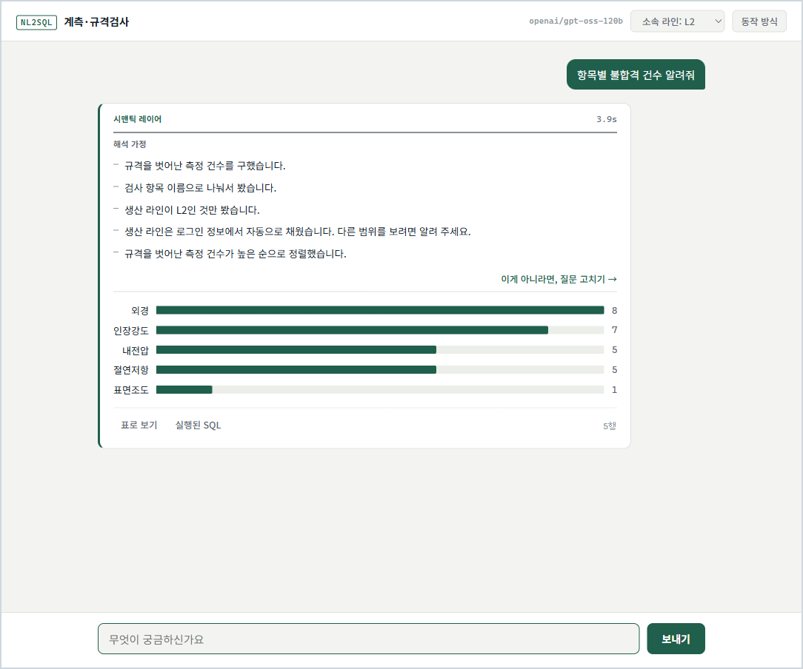
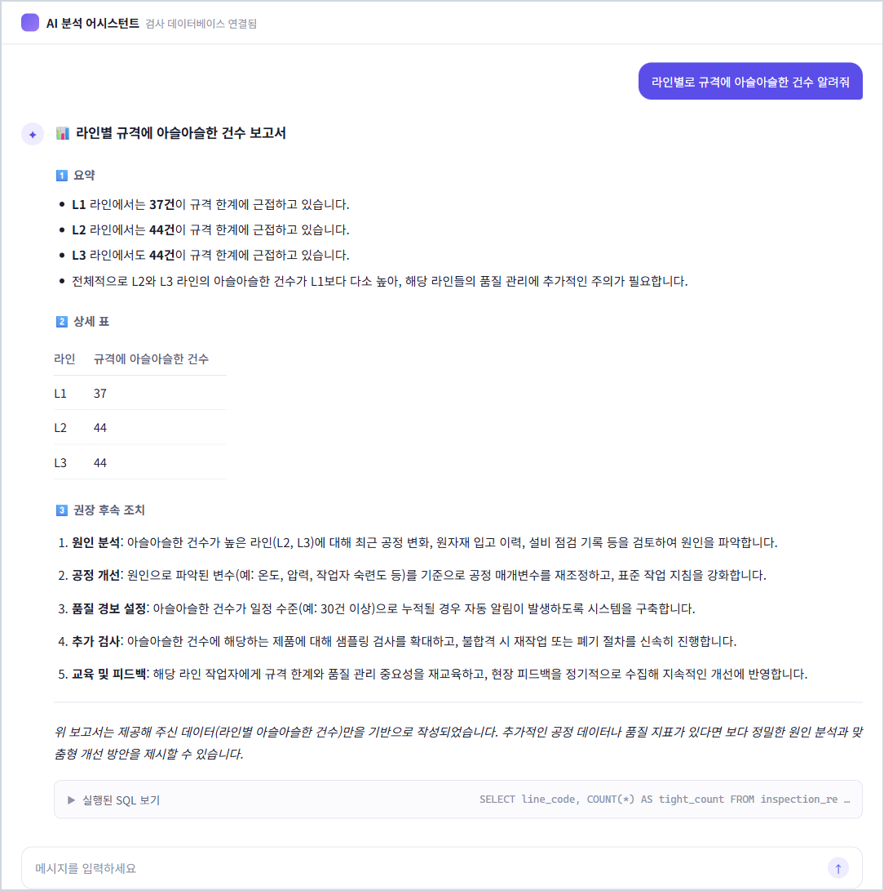
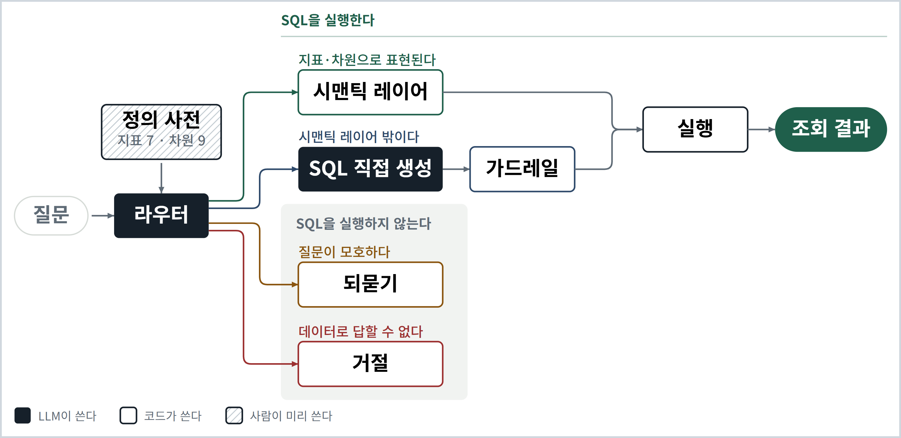

# Natural Language to SQL

자연어 질문을 SQL로 바꿔 실행하는 레퍼런스 구현.
코어는 도메인을 모르고, 도메인 지식은 [`domain/catalog.py`](domain/catalog.py) 하나에 모여 있다.
새 도메인에 붙이는 일은 코어를 고치는 것이 아니라 그 파일을 새로 쓰는 일이다.

> LLM 제품이 실패하는 방식은 대개 에러가 아니다. **틀린 답이 틀린 티를 안 내는 것이다.**

그래서 이 저장소는 정확도가 아니라 **사용자에게 나간 조용한 오답**을 센다.
구조를 먼저 정하지 않았다. 무엇을 셀지부터 바꾸고 그다음에 구조를 짰다.

그 구조는 폐쇄망에서 온프렘 소형 모델로 돌려야 하는 제약 아래에서 나왔다.
원 도메인의 스키마와 데이터는 그대로 못 옮겨서 계측·규격 검사로 치환했고, 옮긴 것은 모호성의 종류와 사고의 유형이지 원 도메인 자체가 아니다.
오프라인이 기본값인 것도, 뒤에 나오는 모델 비교에 0.5B가 끼어 있는 것도 그 제약의 결과다.

이 저장소는 운영 통계에서 시작한 것도 아니다. 조용한 오답 한 건을 보고, 그 유형을 재현할 수 있는 최소 구성을 만들었다.
**그래서 재현은 되지만 빈도는 모른다.** 아래 숫자들은 전부 이 경계 안에 있다.



늘 결과보다 해석 가정이 먼저 온다.

## 돌려보기

```bash
pip install -e '.[dev]'
python -m domain.seed    # inspection.db (고정 시드)
```

### 물어보기

백엔드는 `.env`로 정한다. 키를 꽂는 쪽이 제일 빠르다.

```bash
pip install -e '.[api]'
cp .env.example .env             # NL2SQL_OFFLINE=0, NL2SQL_LLM, API 키 세 줄을 켠다
uvicorn app.server:app --reload  # http://127.0.0.1:8000
```

오프라인 모드가 기본이라 세 줄을 다 켜야 데이터가 밖으로 나간다.
나가면 안 되는 망이면 로컬 가중치를 쓴다.

```bash
pip install -e '.[local-llm]'
cp .env.example .env             # NL2SQL_HF_MODEL에 이미 받아 둔 가중치 경로
uvicorn app.server:app --reload
```

### 조용한 오답 되돌려 보기

```bash
python -m demo  # 정의 한 줄을 되돌려 조용한 오답을 재현한다
```

질문과 라우팅을 고정한 재생이다. 직접 물어보는 곳은 위의 서버다.
일곱 장면이 한 줄기로 이어진다. 그럴듯한 숫자가 나오고, 정답을 옆에 놓으면 틀렸고,
해석 가정을 켜면 어긋난 자리가 한 문장에서 짚이고, 정의 한 줄을 고치면 그 유형이 사라진다.
모델은 `StubLLM`으로 고정한다. LLM 없이 돌고, 변수가 정의 한 줄만 남아야
모델을 바꿔서 될 일이 아니라는 것이 보이기 때문이다.

## 어디에 무엇이 있는가

이 문서는 사용법이 아니라 논증이다. 코드부터 볼 사람은 V로 가면 된다.

- [I. 무엇을 세는가](#i-무엇을-세는가) — 흔한 구현이 낸 그럴듯한 오답 하나를 보고 정확도 대신 셀 것을 바꾼다.
- [II. 왜 생기는가](#ii-왜-생기는가) — 정보가 입력에 없고, 모호성은 두 종류이며 다루는 시점이 다르다.
- [III. 어떻게 가르는가](#iii-어떻게-가르는가) — 네 갈래로 나누고 해석 가정을 역산한 다음, 이 구조의 천장까지 본다.
- [IV. 근거](#iv-근거) — 다섯 모델을 흔한 구현으로 한 번, 이 저장소의 구현으로 한 번 돌려 쟀다.
- [V. 코드를 읽는 순서](#v-코드를-읽는-순서) — 소스 37개 중 논지가 든 일곱 개를 짚는다.
- [VI. 만들 것인가](#vi-만들-것인가) — 안 만들어도 되는 경우와 NL2SQL 밖으로 가져갈 다섯 가지를 본다.

---

# I. 무엇을 세는가

## 그럴듯한 오답

실무에서 나올 법한 질문 하나를 넣었다.

```
라인별로 규격에 아슬아슬한 건수 알려줘
```

스키마를 프롬프트에 넣고, 모델이 SQL을 쓰고, 실행하고, 결과를 한국어로 설명하게 했다.
NL2SQL 제품 대부분이 이 모양이고 이 문서는 이것을 흔한 구현이라 부른다.
gpt-oss 120B가 돌려준 답이다.

일부러 약하게 만들지 않았다. 이 저장소가 쓰는 것과 같은 큐레이션 뷰를 주고
컬럼 설명도 그대로 실어 줬다. 조인 팬아웃도 소프트 삭제도 이미 없앤 상태로 시작한다.



표가 떴고, 숫자가 그럴듯하고, 해석이 붙었고, 후속 조치가 다섯 단계로 정리됐다.
에러도 경고도, 신뢰도 점수 자체도 없다.

맞은 것부터 보자. 뷰도 컬럼도 정확하다.
`slack_rank`는 여유를 항목 안에서 줄 세운 백분위이고 0이 가장 아슬아슬한 쪽이니 축도 방향도 맞다.
`0.1`은 지어낸 값도 아니다. 컬럼 설명에 예시로 적혀 있다.
흔들려서 틀린 것도 아니다. 다섯 번 돌려 다섯 번 같은 SQL이 나온다. 안정적으로 틀린다.

**뒤집힌 것은 순위다.**

| 라인 | 모델 출력 | 실제 규격 내 경계 근접 건수 |
|---|---|---|
| L1 | 37 (제일 적음) | **29 (제일 많음)** |
| L2 | 44 | 20 |
| L3 | **44 (제일 많음)** | **12 (제일 적음)** |

사용자는 L3부터 손대러 간다. 실제로 손봐야 할 곳은 L1이다.

사용자가 이걸 알아챌 방법은 없다.

- SQL을 읽을 수 있으면 이 제품이 필요 없다.
- 숫자는 전부 진짜다. DB에 실제로 있는 값이고 집계도 정확하다.
- 행이 세 줄이고 값이 37·44·44다. 트집 잡을 모양이 아니다.
- 설명 열아홉 줄 어디에도 무엇으로 이해했는지가 없다.

마지막 줄이 핵심인데 이 화면은 그것보다 나쁘다. 요약의 첫 줄은 이렇게 말한다.

> "**L1** 라인에서는 **37건**이 규격 한계에 근접하고 있습니다."

말은 옳다. 「규격 한계에 근접」은 사용자가 물은 것을 그대로 옮긴 표현이다.
숫자도 옳다. 방금 본 그대로다.
그런데 저 말이 가리키는 것과 저 숫자가 센 것이 서로 다르다.
말은 규격 안에서 경계에 가까운 것을 뜻하고, 숫자는 이미 규격을 벗어난 것까지 세었다.
**어느 쪽도 틀리지 않아서 어긋난 자리가 안 보인다.**

설명이 SQL을 본 적이 없어서 그렇다. 질문과 결과 행만 받아서 쓴다.
질문의 말로 질의의 숫자를 덮으면 앞뒤가 맞는 문장이 언제나 나온다. 맞았는지와는 무관하게.

길게 쓴다고 해석을 밝힌 것이 아니다.
열아홉 줄이 한 일은 질문을 고쳐 말한 것이고, 밝혀야 할 「이번에 무엇으로 걸렀는가」는 한 줄도 없다.

## 시끄러운 실패와 조용한 오답

실패는 두 종류다. 같은 이름으로 부르면 안 된다.

| | 무엇인가 | 사용자가 아는가 |
|---|---|---|
| 시끄러운 실패 | 예외, 타임아웃, 생성 실패. 답이 안 나간다 | 안다 |
| 조용한 오답 | 조회 결과가 나갔는데 물은 것에 대한 답이 아니다 | **모른다** |

시끄러운 쪽은 나쁘지만 위험하지 않다. 문법이 틀린 SQL, 없는 테이블, 타임아웃.

조용한 쪽은 실행된다. 표가 뜬다. 숫자가 나온다. 그리고 틀렸다.
**이 저장소가 세는 것은 조용한 오답이다.**

되묻기와 거절은 시끄러운 쪽으로 친다. 조회 결과가 안 나갔고, 사용자가 그것을 안다.
실패가 아니라 정직한 상태이므로 실패로 세지 않는다.
실패로 세면 되묻거나 거절할 이유가 시스템에서 사라진다.

앞의 흔한 구현 화면은 모델이 틀린 경우다. 그런데 **모델이 다 맞혀도 조용한 오답은 난다.**
아래는 이 저장소에서 실제로 나온 것들이고 셋 다 모델이 옳은 이름을 고른 뒤에 일어났다.

- 필터 값이 문자열로 바인딩 되어 조건이 통째로 무력화됐다. 같은 SQL, 결과만 수백 배 틀림.
- 항목마다 단위가 달라 절댓값 비교가 뒤집혔다. 목록은 나왔고, 순위만 거꾸로.
- 항목별 백분위의 최솟값을 항목 간 비교에 썼다. 모든 행이 0.0, 정렬까지 맞음.

모델은 안 틀렸다. **정의와 조립이 틀렸다.** 그래서 모델을 바꿔도 그대로 남는다.

개발에서는 시끄러운 쪽을 선호한다. 컴파일 에러가 런타임 에러보다 낫고
런타임 예외가 조용히 잘못된 값보다 낫다는 것은 오래된 상식이다.
그런데 LLM 제품에는 그 잣대를 잘 안 댄다. 대개 환각이라는 한 단어로 묶고 넘어간다.

## 손쉬운 답 두 개

이 문제를 말하면 답이 둘 돌아온다. 둘 다 안 된다.

**"더 좋은 모델을 쓰면 된다."**

모델을 키우면 라우팅은 정확해진다. 갈래를 더 잘 고르고 지표 이름을 덜 헛짚는다.
그런데 같은 개선이 조용한 오답 쪽에서는 반대로 작동한다.
**잘 맞히는 모델은 틀릴 때 더 그럴듯하게 틀린다.**
그 숫자는 [여기](#모델을-키우면-어떻게-되는가)에 있다.

**"출력을 검사하면 된다."**

이건 재 볼 것도 없이 구조적으로 실패한다.

| 검사 방법 | 왜 안 되는가 |
|---|---|
| SQL을 보여주고 확인시킨다 | 사용자가 SQL을 읽을 수 있으면 애초에 이 제품이 필요 없다 |
| 다른 모델에게 검증시킨다 | 같은 정보로 같은 추측을 한다. 없는 정보는 검증자에게도 없다 |
| 신뢰도 점수를 붙인다 | 모델은 자기가 대체했다는 것을 모른다. 모르는 것에 대한 확신은 높게 나온다 |
| 행수·널값 상식 검사 | `SELECT COUNT(*)`는 조건이 아무것도 못 맞혀도 값이 0인 1행을 돌려준다 |

공통점이 있다. **틀린 것은 해석이다.**
출력은 그 해석의 충실한 실행 결과라서 출력만 봐서는 멀쩡하다.

## 벤치마크에는 정답이 있고 운영에는 없다

NL2SQL에는 잘 만들어진 벤치마크가 있다. 리더보드도 활발하고 점수도 매년 오른다.
벤치마크 DB에 함정이 적다는 지적은 오래됐다. 그 지적을 먼저 한 것도, 반영한 것도 그 분야다.
BIRD가 값이 지저분한 실제 DB를, Spider 2.0이 컬럼 1,000개가 넘는 실사용 DB를 가져왔다.

효과는 컸다. Spider 1.0에서 91.2%를 내던 모델이 Spider 2.0에서 17.0%로 떨어졌다.
DB를 실무 것으로 바꾸자, 훨씬 많이 틀렸다.
그 숫자는 앞의 91.2%가 무엇을 재고 있었는지도 같이 말해 준다.

그러니 "벤치마크 DB가 현실적이지 않다"는 비판은 이제 유효하지 않다.
남는 것은 하나뿐이다. **Spider·BIRD 리더보드의 채점 축은 안 바뀌었다.** 여전히 정답 SQL 하나와 대조한다.

옆에 정답이 있으니 잘 도는 오답도 벤치마크는 정확히 잡아낸다.
운영에는 그 정답이 없다. 있었으면 물어볼 이유가 없다.
같은 답이 채점되지 않고 그대로 사용자에게 나간다.

**벤치마크는 사후에 잡고 운영은 사전에 막아야 한다.** 여기서 셋이 갈린다.

**하나. 답이 없거나 여럿인 질문은 데이터셋에 못 들어간다.**

`작업자별 불합격률 뽑아 줘`에는 정답 SQL을 붙일 수가 없다. 작업자 컬럼이 이 데이터에 없다.
Execution Accuracy로 채점하려면 억지로 비슷한 컬럼을 골라 정답을 만들거나 질문을 빼야 한다.
어느 쪽이든 올바르게 거절한 시스템이 점수를 잃거나 채점 대상에서 사라진다.

되묻기도 같다. `요즘 문제 있는 라인`의 정답 SQL은 존재하지 않는다.
답이 하나로 정해지지 않는 것이 그 질문의 성질이기 때문이다.

정답을 붙일 수 있는 질문만 데이터셋에 남는다.
**실무에서 사고가 나는 질문이 데이터셋을 만드는 단계에서 걸러진다.**
셋 중 이게 제일 세다. 나머지 둘은 채점 방식의 문제인데 이건 표본의 문제다.

**둘. 거절에 보상이 없다.**

거절은 확정 0점이다. 틀린 추측도 0점이다.
그러면 맞을 확률이 조금이라도 있는 쪽이 기대점수가 높다.
감점당하지는 않는다. 보상이 없을 뿐이다.
채점기가 거절을 벌하지는 않는다. 다만 잘한 거절과 엉터리 추측을 같은 칸에 넣는다.

**셋. 두 실패가 한 칸에 들어간다.**

예외로 죽은 것과 조회 결과가 나갔는데 틀린 것이 똑같이 0점이다.
이건 벤치마크의 결함이 아니다. 정답이 옆에 있으니 구분할 이유가 없다.
운영에서만 갈라진다. 예외로 죽으면 사용자가 알고 표가 나가면 모른다.

그래서 같은 데이터가 두 이야기를 한다.
총 실패만 세면 모델을 키워서 문제가 절반 풀린 것처럼 보이고
갈라서 세면 줄어든 쪽이 전부 안전한 실패라는 것이 보인다.

| | 벤치마크 | 운영 |
|---|---|---|
| 정답 | 있다 | 없다 |
| 틀렸을 때 | 채점기가 0점을 준다 | 그대로 사용자에게 나간다 |
| 답이 없는 질문 | 데이터셋에서 빠진다 | 매일 들어온다 |
| 거절 | 0점 | **필요한 동작** |

벤치마크는 안 틀렸다. 정의한 과제가 다를 뿐이다.
그 위에서 점수를 올리는 일은 정직한 공학이다.
다만 그 점수가 정답 없는 환경을 말해 주지는 않는다.

**바꾼 것은 아키텍처가 아니라 무엇을 세느냐다. 그다음에야 아키텍처가 정해진다.**

**"그러면 왜 그 판에서 겨루지 않는가"**

돌릴 수 없어서가 아니다. 시맨틱 레이어 경로가 사람이 쓴 정의라서, Spider 200개·BIRD 95개 데이터베이스만큼 정의를 써야 이 구조가 평가된다. 정의 없이 올리면 전부 SQL 직접 생성으로 떨어져 흔한 구현만 재게 된다. 겨냥도 반대다 — 벤치마크는 처음 보는 스키마로의 일반화를 재지만, 이 구조는 도메인마다 사람이 쓰는 정의 쪽에 걸었다.

---

# II. 왜 생기는가

## 정보가 입력에 없다

한 검사원이 묻는다.

```
요즘 문제 있는 라인 알려줘
```

사용자의 입력은 원래 친절하지 않다.
시스템 구조를 몰라서일 수도 있고 그냥 귀찮아서일 수도 있다.
어느 쪽이든 그 질문이 시스템에 들어온다.
받는 쪽에서는 이런 것들이 한꺼번에 걸린다.

> 「문제」라고 함은 `verdict = 'FAIL'`인가? 규격 안이지만 경계에 아슬아슬한 것도 문제 아닌가?
> 스키마에 주석 잘 달고 프롬프트로 넘겨주면 될 것 같은데, 애초에 「문제」라는 필드가 없으면?
> 불합격 건수로 세나 불합격률로 세나? 건수로 세면 물량 많은 라인이 늘 1등일 텐데.
> 「요즘」은 7일인가 30일인가 이번 달인가? 폐기된 로트는 빼야 하나?

**사용자가 원하는 쿼리는 분명히 존재한다. 우리가 그걸 특정할 수 없을 뿐이다.**

정해진 것도 있다. '라인별로'는 확정이다. 전부가 모호한 게 아니라 일부가 모호하다.
이걸 **구조적 미결정성**이라 부르자. 정보가 입력에 없거나 있어도 하나로 좁혀지지 않는다.
모델을 탓할 자리가 아니다. 질문의 성질이 그렇다.

로그인 세션에서 부서나 라인을 자동으로 채워 넣는 방법이 있고 실제로 쓴다.
동적 퓨샷으로 그 사용자의 과거 질문을 붙여 주는 방법도 있다.
둘 다 유용하지만 둘 다 위 목록을 없애지는 못한다.
앞의 것은 축 하나를 채울 뿐이고 뒤의 것은 그 사용자에 대한 기록이 쌓인 뒤에야 가능하다.

**그런데 모델은 답을 낸다.** 항상 낸다.
없는 정보를 물으면 가장 그럴듯한 값으로 채운다.
그리고 채웠다는 사실을 안 적는다. 자기가 채웠다는 것을 모르기 때문이다.

이게 출력 검사 네 가지가 전부 실패하는 이유다.
**어디까지가 근거고 어디부터가 채운 것인지 모델 자신도 모른다.**
그러면 더 좋은 모델도, LLM-as-Judge도, 신뢰도 점수도 그것을 복원할 수 없다.

이건 모델 성능의 문제가 아니라 정보 가용성의 문제다.
사용자의 의도는 사용자 머릿속에만 있고 출력에는 없다.
출력을 아무리 들여다봐도 거기서 나오지 않는다.

같은 모양이 LLM 제품 전반에서 나온다.

| 제품 | 어떻게 그럴듯하게 넘어가는가 |
|---|---|
| RAG | 근거 문서가 없어도 가장 가까운 문서로 답한다 |
| 에이전트 | 실패한 단계를 성공으로 요약하고 다음으로 넘어간다 |
| 요약 | 원문에 없는 인과를 넣는다 |
| NL2SQL | 없는 컬럼을 가장 비슷한 컬럼으로 바꿔 실행한다 |

넷 다 에러가 없고, 출력이 그럴듯하고, 대체했다는 사실이 어디에도 안 남는다.

## 모호성은 두 종류다

사후에 검사할 수 없다면 사전에 갈라야 한다.
그러면 무엇이 사전에 갈리는지부터 정해야 한다.
전부 같은 방법으로 다루면 안 된다. 두 종류는 성질도 다루는 시점도 다르다.

| | 무엇이 모호한가 | 누가 언제 답을 아는가 | 어떻게 다루는가 |
|---|---|---|---|
| **의도** | 용어의 정의, 기간 기준, 포함 범위 | 사용자가, 질문한 순간에 | **보이게** 만든다 |
| **사실** | 조인 입도, 바인딩 타입, 단위, 값 표기 | 정의를 쓰는 사람이, 정의 시점에 | **일어날 수 없게** 만든다 |

가르는 기준은 **답을 아는 사람이 누구이고 언제 아는가**다.

의도는 사용자만 안다. 그리고 질문한 그 순간에만 안다.
미리 정해 둘 수가 없으니 보여주고 확인받는 수밖에 없다.

사실은 정의를 쓰는 사람이 안다. 그리고 정의 시점에 이미 안다.
조인 입도를 어떻게 잡을지, 어느 축이 항목 간 비교에 유효한지는 질문을 받기 전에 정해진다.
**이미 정할 수 있는 것을 질문 때마다 물으면 확인이 아니다. 미결정을 사용자에게 떠넘긴다.**

위 목록도 이 기준으로 갈린다.
「문제」와 「요즘」은 의도다. 사용자만 안다.
건수냐 률이냐, 폐기 로트를 뺄 것이냐는 사실이다. 정의를 쓸 때 이미 정할 수 있다.

흔한 구현 화면에서 본 것이 둘째였다. 어느 축으로 거를지는 정의를 쓸 때 정해졌어야 한다.

---

# III. 어떻게 가르는가

## 질문을 네 갈래로 나눈다

정답이 없으니 답이 나온 뒤에 검사할 수 없다. 나가기 전에 갈라야 한다.
가를 것은 셋이다 — 답할 수 있는가, 답이 하나로 좁혀지는가, 지표·차원으로 표현되는가.



| 갈래 | 언제 | 무엇을 하는가 |
|---|---|---|
| `semantic` | 지표·차원으로 표현되는 질문 | 시맨틱 레이어가 결정론적으로 SQL을 만든다 |
| `clarify` | 답은 되지만 입력이 미결정 | 되묻고, 고를 수 있는 완결 후보를 함께 낸다 |
| `abstain` | 데이터로 답할 수 없다 | 못 한다고 말한다 |
| `free` | 시맨틱 레이어 밖이지만 뷰로는 답이 된다 | SQL 직접 생성 + 가드레일 다섯 겹 |

라우터는 모델을 한 번 부르고 그 조합인 넷 중 하나를 고른다.
고른 갈래가 실패해도 다른 갈래로 다시 시도하지 않는다. 되묻기로 내려갈 뿐이다.

이 분류는 새롭지 않다.
Cube, dbt Semantic Layer, Looker는 정의된 지표·차원으로 SQL을 만드는 일을 오래 전부터 제품으로 판다.
Wren AI나 Cortex Analyst도 라우팅과 되묻기를 한다.
새로운 것은 분류가 아니라 **무엇을 세느냐**다.

`semantic`에서 모델이 돌려주는 것에는 SQL 문자열이 아예 없다.
기여할 수 있는 것은 **여덟 개 토큰**뿐이다. 비교 연산자 여섯과 `asc` `desc`.
나머지는 전부 정의에 있는 이름이고 없으면 컴파일이 실패한다.
**프롬프트로 시킨 것이 아니라 받는 쪽 타입이 그렇게 생겼다.**
SQL 텍스트를 직접 쓰는 곳은 `free` 하나이고 거기는 가드레일 다섯 겹이 받는다.

### 질문 하나가 SQL이 되기까지

앞 문단은 주장이므로 코드가 실제로 주고받은 것을 그대로 옮긴다. 이 질문은 뒤에서 다시 나온다.

```
[1] 질문

    "항목별 불합격 건수 알려줘"
    로그인 컨텍스트: line_code = L2

[2] 모델이 받는 어휘 — 이름과 설명뿐이다. 식도 물리 스키마도 없다

    지표 7, 차원 9, 값 사전, 뷰 설명이 통째로 들어간다. 여기 쓰인 둘만 옮긴다
    - fail_count: 규격을 벗어난 측정 건수 (synonyms: 불합격 건수, 부적합 건수, 탈락 건수)
    - item_name: 검사 항목 이름 (인장강도, 외경 등) (synonyms: 항목, 검사 항목, 측정 항목)

[3] 모델이 내는 것 — JSON 하나. 받는 쪽 스키마에 SQL 필드가 없다

    {"route": "semantic",
     "semantic_query": {"metrics": ["fail_count"], "dimensions": ["item_name"],
                        "filters": [], "order": null, "distinct": false}}

[4] 컴파일러가 이름으로 정의를 찾는다 — 여기서 처음 SQL 조각이 나온다

    fail_count -> SUM(CASE WHEN verdict = 'FAIL' THEN 1 ELSE 0 END)
    item_name  -> item_name

[5] 같은 질의 객체 하나에서 두 갈래가 나온다

    SQL (실행된다)
    SELECT item_name AS item_name,
           SUM(CASE WHEN verdict = 'FAIL' THEN 1 ELSE 0 END) AS fail_count
    FROM inspection_results WHERE line_code = ?
    GROUP BY item_name ORDER BY fail_count DESC, item_name ASC LIMIT 100
    바인딩 ['L2']

    한국어 (보여준다)
    규격을 벗어난 측정 건수를 구했습니다.
    검사 항목 이름으로 나눠서 봤습니다.
    생산 라인이 L2인 것만 봤습니다.
    생산 라인은 로그인 정보에서 자동으로 채웠습니다. 다른 범위를 보려면 알려 주세요.
    규격을 벗어난 측정 건수가 높은 순으로 정렬했습니다.
```

모델이 값을 써넣는 자리는 필터의 연산자와 `order` 둘뿐이고 각각 여섯 개와 두 개짜리 닫힌 집합이다.
앞 문단의 여덟 토큰이 그 합이다. 나머지는 이름이라 [4]에서 정의에 없으면 컴파일이 실패한다.
필터 값은 SQL에 안 실린다. `?` 자리에 바인딩으로 들어가므로 값에 무엇이 오든 텍스트가 되지 않는다.

읽을 것은 [5]다. 두 출력이 같은 객체에서 나오므로 어긋날 수가 없다.
검사해서 맞춘 것이 아니라 어긋날 자리가 없는 것이고, 그 성질은 뒤에서 따로 본다.

`free`는 [3]이 JSON이 아니라 SQL 문자열이다. 중간에 객체가 없으니 [5]의 갈래가 생기지 않는다.

### 잘못 갔을 때 무엇이 받치는가

라우팅 오류는 대칭이 아니다.

| 잘못 간 방향 | 무엇이 받치는가 |
|---|---|
| `abstain` → `semantic` | 정의에 없으므로 컴파일이 실패한다. **안전** |
| `semantic` → `free` | 신뢰도는 떨어지지만 가드레일 다섯 겹이 받는다 |
| `free` → `semantic` | **받는 것이 없다.** 정의에 있는 이름으로만 고르면 컴파일이 통과한다 |
| `clarify` → `semantic` | **받는 것이 없다.** 컴파일도 가드도 통과하고 숫자도 그럴듯하다 |
| `abstain` → `free` | **받는 것이 없다.** 가드레일은 SQL이 위험한지만 보고 답이 되는지는 안 본다 |

세 줄이 같은 사실에서 나온다. **시맨틱 레이어는 이름이 정의에 있는지만 본다.**
이름은 사실이라 닫힌 집합으로 대조되지만, 그 답이 물은 것에 답하는지는 의도라서 대조할 것이 없다.

「받는 것이 없다」가 방어가 없다는 말은 아니다. 시스템이 자기 힘으로 멈추는 층이 없다는 뜻이다.
여기서 멈출 수 있는 것은 사용자뿐이고, 그러라고 해석 가정을 결과보다 먼저 내보낸다.
세 칸이 다음 절의 이유다.

## 모델은 어디까지 관여하는가

라우팅 그림의 검은 상자가 모델이 쓰는 자리다. 전부 정산하면 두 칸이다.

| 자리 | 모델이 하는 일 | 코드가 하는 일 |
|---|---|---|
| 라우팅 | 네 갈래 중 하나를 고른다 | 갈래가 넷뿐이라는 것을 강제한다 |
| `semantic` 질의 | 지표·차원 이름과 여덟 토큰을 고른다 | 이름을 정의와 대조하고 SQL을 만든다 |
| `free` SQL | SQL 텍스트를 직접 쓴다 | 가드레일 다섯 겹으로 받는다 |
| 되묻기 후보 | 후보 질의를 만든다 | 고른 뒤에는 모델을 다시 안 부른다 |
| 해석 가정 | **없다** | 컴파일된 질의에서 역산한다 |

**모델이 판단하는 곳은 라우팅 하나다.** 나머지는 이름을 고르는 일이고, 그 이름은
정의에 있거나 없거나 둘 중 하나다. 마지막 줄이 이 구조의 핵심이라 뒤에서 따로 본다.

### 프롬프트로 시킨 것과 하네스가 보증한 것

여기서 하네스는 **모델 출력을 받는 쪽에 있고, 모델이 협조하지 않아도 성립하는 코드**다.
위 표의 오른쪽 열이 그것인데, 전부 같은 급은 아니다. 가르는 질문은 하나다 —
**모델이 침묵하거나 거짓말해도 이게 남는가.**

"항상 근거를 적어라"는 지시이고 "비면 시스템이 채운다"는 보증이다.
지시는 모델이 안 따르면 그만이고 보증은 모델이 무엇을 돌려주든 성립한다.

| | 무엇을 하는가 | 이 배포에 있는가 |
|---|---|---|
| **제약** | 애초에 못 쓰게 한다 | **없다** |
| **거부** | 쓴 것을 검증해서 틀리면 안 쓴다 | 있다 |
| **대체** | 쓴 것을 안 보고 시스템이 쓴다 | 있다 |

쓰는 백엔드 둘 다 구조화 출력 강제가 없어 스키마가 프롬프트에 실려 나간다.
그래서 위의 여덟 토큰도 「제약」이 아니라 시맨틱 레이어가 다시 검증하는 「거부」 줄에 있다.
같은 여덟 토큰이라도 어느 층이 지키는지는 배포에 따라 다르다.
**무엇을 걸었는지가 아니라 어디가 그것을 강제하는지를 봐야 한다.**

아래 절들은 전부 이 구분 위에 있다. 해석 가정이 「대체」이고, 가드레일이 「거부」다.

## 의도 — 결과보다 해석 가정이 먼저 온다

의도를 아는 것은 사용자뿐이므로 방향 자체는 달리 잡을 수 없다.
시스템이 무엇으로 이해했는지를 먼저 내놓고 사용자가 자기 의도와 대조하게 한다.

```
질문: 항목별 불합격 건수 알려줘
로그인 컨텍스트: 라인 = L2

해석 가정:
  규격을 벗어난 측정 건수를 구했습니다.
  검사 항목 이름으로 나눠서 봤습니다.
  생산 라인이 L2인 것만 봤습니다.
  생산 라인은 로그인 정보에서 자동으로 채웠습니다. 다른 범위를 보려면 알려 주세요.
  규격을 벗어난 측정 건수가 높은 순으로 정렬했습니다.
```

사용자는 SQL을 못 읽는다. 하지만 이 다섯 줄은 읽는다.
그리고 자기 의도와 다르면 그 자리에서 말할 수 있다.

넷째 줄은 사용자가 말한 적 없는 조건이다.
로그인 정보가 답의 범위를 좁혔고 좁혔다는 사실이 같은 자리에 적힌다.
이 줄이 없으면 표는 그대로인 채 전사 수치로 읽힌다.

문장에 지표·차원 이름이나 연산자를 넣지 않는다.
`fail_count`나 `>=`를 보여주고 확인하라고 하면 확인할 수 없는 것을 시킨 것이고
그러면 보여주지 않은 것과 같다. 이름은 SQL 패널에 있다.

### 이 가정은 모델이 쓰지 않는다

여기가 이 경로의 핵심이고 없으면 나머지가 다 무너진다.

당연한 반문이 하나 있다. **그 해석 가정도 모델이 쓴 것 아닌가.**
모델이 썼다면 같은 문제다. 그럴듯한 가정을 적어 놓고 실제로는 딴 질의를 날려도 아무도 모른다.
검사 대상이 출력에서 문장으로 바뀌었을 뿐 성질이 같다.

그래서 그렇게 하지 않는다. **가정을 컴파일된 질의에서 역산한다.**
모델이 뭐라고 설명했든 안 본다. 실제로 실행될 SQL을 만든 그 질의에서 되짚어 문장을 만든다.

| | 모델이 쓴 문장 | 역산한 문장 |
|---|---|---|
| 모델이 인지 못한 가정 | 빠진다 | **안 빠진다** |
| 실제 질의와 어긋날 수 있는가 | 있다 | **없다. 같은 것에서 나왔다** |
| 시맨틱 레이어에 없는 경고 | 운이 좋으면 나온다 | **절대 안 나온다** |

마지막 줄이 이 구조가 치르는 대가다. 아래에서 그 대가를 본다.

### 되묻기는 묻고 끝나면 안 된다

되물어 놓고 답을 받을 자리가 없으면 사용자는 질문을 통째로 다시 쓴다.
그 순간 첫 질문이 이미 확정했던 것이 사라져 같은 문제가 반복된다.

실제로 그랬다. `요즘 문제 있는 라인`에 되묻고 "불합격률 기준, 최근 한 달"이라 답했더니
`line_code`가 통째로 빠진 채 전체 평균 한 줄이 나왔다. **되물어 놓고 답이 더 나빠졌다.**

그래서 답을 자유 텍스트가 아니라 지표·차원으로 받는다.
선택지 하나하나가 그대로 실행 가능한 완결 질의다.
고르는 순간 모델을 다시 부르지 않는다 — 라우팅도 생성도 없이 **0.0초**다.

후보는 모델이 만들었으니 전부 빗나갈 수 있다.
탈출구가 없으면 사용자는 틀린 선택지 중에서 고르고, 고른 순간 그것이 확정된 의도가 된다.
그래서 「이 중에 없습니다」가 항상 함께 나가고, 누르면 원래 질문이 입력창으로 돌아온다.

거절도 같은 급의 출력이다. 데이터에 없는 것을 가장 가까운 컬럼으로 대신 답하지 않는다.
예외 처리가 아니라 라우터가 고르는 네 갈래 중 하나다.
이 자리가 갈래로 없으면 시스템은 무슨 질문에도 답을 만들어 낸다.

**그리고 이 판단은 벤치마크 점수를 깎는다.**
벤치마크는 거절을 틀린 추측과 같은 0점으로 센다.
점수로만 보면 손해만 나는 갈래이고 두 실패를 갈라서 봐야 왜 두는지가 보인다.

## 천장 — 시맨틱 레이어가 표현할 수 없는 것

이 경로가 어디서 멈추는지도 보고 가야 한다. 여기가 이 구조의 천장이다.

`규격에 아슬아슬한 항목 알려줘`를 던지면 표가 뜨고 해석 가정 다섯 줄이 무엇으로 이해했는지
밝힌다. 흔한 구현에는 없던 것이다. 그런데 같은 질문에 이것도 나온다.
항목 구성이 다르고 다섯 줄 중 셋째 줄 하나만 다르다. 두 화면의 그 줄만 나란히 놓는다.

```
첫 화면: 규격 경계까지의 여유가 0.05보다 작은 것만 봤습니다.
둘째 화면: 항목 내 여유 백분위가 0.05보다 작은 것만 봤습니다.
```

뷰가 여유를 두 가지로 파생시켜 둔다.

| | 무엇인가 | 단위 |
|---|---|---|
| `spec_slack` | 규격 경계까지 남은 거리 | **측정값과 같다** (mm, MΩ, …) |
| `slack_rank` | 그 거리를 항목 안에서 줄 세운 백분위 | **없다** (0~1) |

둘 중에는 둘째가 낫다. 항목마다 단위가 다르기 때문이다.

| 항목 | 단위 | 합격품 평균 여유 | 첫 화면에 걸린 건수 |
|---|---|---|---|
| 외경 | mm | 0.0331 | **227건 (합격품 전부)** |
| 내전압 | kV | 0.8933 | 3건 |
| 표면조도 | µm | 0.5596 | 2건 |
| 인장강도 | MPa | 50.63 | 0건 |
| 절연저항 | MΩ | 666.12 | 0건 |

외경은 규격 폭 자체가 0.05mm보다 좁다. 그래서 합격품 227건이 통째로 걸린다.
절연저항은 평균 여유가 666 MΩ이라 같은 0.05가 아무것도 안 남긴다.
**첫 화면은 위험한 항목이 아니라 규격이 좁은 항목을 세고 있다.**

여기까지는 단위를 아는 사람이면 저 한 줄을 읽고 판단할 수 있다.
흔한 구현 화면과 달리 시스템이 숨긴 것이 없다. 어느 축으로 걸렀는지 문장이 정확히 밝힌다.

**문제는 화면이 하나일 때다.**

두 답을 잇달아 놓았기 때문에 축이 둘이라는 것을 알았다. 실무에서는 한 번만 묻는다.
첫 화면만 보면 대조할 것이 없고 "여유가 0.05보다 작은 것만 봤습니다"는 그 자체로는
이상해 보이지 않는다. 그대로 외경이 제일 위험하다고 읽고 거기부터 손댄다.

**그리고 시스템은 "이 축은 항목 간 비교에 못 쓴다"고 말해 줄 수가 없다.**

가정을 역산하니 정의가 인코딩한 것만 말할 수 있다.
`Dimension`에는 이름, 식, 설명, 동의어, 숫자여부, 순서여부밖에 없고
"이 축은 항목 간 비교가 무효"를 담을 자리가 없다.

역산의 강점과 한계는 뿌리가 같다.
모델이 인지하지 못한 가정은 안 빠진다. 대신 정의에 없는 경고가 애초에 못 나온다.
사용자가 무능해서가 아니다. 대조할 화면이 하나뿐이고 표면화 계층이 그 경고를 표현할 수 없어서다.
**표현할 수 없는 것을 보여줬다고 셀 수는 없다.**

어느 축이 옳은지는 정의를 쓸 때 이미 정할 수 있었다. 그건 사실이지 의도가 아니다.

```bash
python -m demo --scene 1  # 절대 여유로 답한 화면
python -m demo --scene 2  # 항목 내 백분위로 답한 화면
```

### 직접 생성도 같은 역산을 한다

`free`는 컴파일러가 없다. 가드가 이미 파싱해 둔 SQL의 구조(테이블·필터·묶음·정렬)를 그대로 문장으로 옮긴다([`ast_guard.QueryStructure`](nl2sql/ast_guard.py), `NL2SQL._free_assumptions`).
모델이 뭐라고 썼든 안 보고 실행될 SQL에서 나온 문장이라 어긋날 수 없다는 성질은 같다.

다만 여기는 축 선택에 제약이 없다. `semantic`은 축을 사람이 쓴 정의에서 고르지만 `free`는 모델이 뷰의 어느 컬럼이든 쓸 수 있다.
그래서 "어떤 컬럼으로 걸렀는가"는 정확히 말해도 "그 축이 이 비교에 유효한가"는 말하지 못한다 — 방금 본 한계와 같은 것이되 `semantic`보다 한 칸 더 낮다.

## 사실 — 정의 시점에 없앤다

사용자가 판단할 수 없는 것은 보여줘 봐야 소용이 없다. 애초에 일어나지 않게 만든다.

큐레이션 뷰 하나가 네 가지를 흡수한다.

| 성질 | 뷰가 없을 때 | 뷰의 처리 |
|---|---|---|
| 조인 팬아웃 | 로트 61건이 측정까지 조인하면 1,220건이 된다 | 입도를 측정 1건으로 고정 |
| 소프트 삭제 | 폐기 로트 11건이 그대로 섞인다 | `is_void = 0`을 미리 건다 |
| 조합 코드 | 사용자는 "기계 항목"이라 묻는데 저장은 `MECH_TENSILE` | `category`로 흡수 |
| 단위 혼재 | 항목 간 여유 비교가 뒤집힌다 | 단위 없는 축을 함께 제공 |

**이 스키마는 일부러 망가뜨린 것이 아니다.**
정규화는 교과서대로다. 폐기 로트를 지우지 않는 것은 이력 보존이고
조합 코드는 제조 MES·ERP에서 흔한 표기다.
그래서 여기서 나오는 오답은 DB를 고쳐서 없앨 수 없다.

앞의 셋은 뷰만으로 닫힌다. **넷째는 뷰만으로 안 닫힌다.**
절대 여유와 백분위가 둘 다 있으므로 어느 축을 노출할지는 시맨틱 레이어가 정한다.
바로 위의 두 화면이 그 선택의 결과다.

### 흔한 구현 화면이 왜 그렇게 됐는가

모델은 `slack_rank < 0.1`로 걸렀다. 축도 방향도 맞고 `0.1`은 컬럼 설명에 적힌 값이다.

| 라인 | 모델이 센 것 | 이미 규격 밖 | 규격 안 |
| :--- | ---: | ---: | ---: |
| L1 | 37 | 19 | 18 |
| L2 | 44 | 26 | 18 |
| L3 | 44 | 28 | 16 |

**125건 중 73건이 이미 규격 밖이다.** 질문은 규격 안에서 아슬아슬한 것을 물었다.
그중 합격은 18·18·16으로 라인끼리 거의 같은데 불합격 수는 19·26·28로 벌어진다.
그래서 합친 숫자가 사실상 불합격 순위를 그대로 옮긴다.

이건 사용자가 판단할 수 있는 종류가 아니다.
「아슬아슬」이 규격 안쪽만 뜻하는지 이미 벗어난 것까지 포함하는지는
질문할 때마다 물을 일이 아니라 정의를 쓸 때 정할 일이다. 그래서 정의가 정해 두었다.

```
near_limit_count = SUM(CASE WHEN verdict = 'PASS' AND pass_slack_rank <= 0.05 THEN 1 ELSE 0 END)
```

`verdict = 'PASS'` 한 조각이 그 결정이고 이유가 옆에 적혀 있다.
이미 규격을 벗어난 건은 `fail_count`가 센다. 두 질문을 한 숫자에 섞지 않는다.

---

# IV. 근거

## 모델을 키우면 어떻게 되는가

앞에서 본 흔한 구현에, 모델만 크기순으로 올려 가며 물었다.
재시도나 자기교정은 안 붙였다. 그쪽이 줄이는 것은 시끄러운 실패라 붙이면 조용한 비율만 올라간다.
실패를 두 종류로 나눠 센다. 이 구분이 논지이므로 측정도 그렇게 해야 한다.
아래 두 표 모두 칸마다 14문항 × 5회 = 70건 판정이다.

| 모델 | 시끄러운 실패 | 조용한 오답 | 총 실패 | 실패 중 조용한 비율 |
| :--- | ---: | ---: | ---: | ---: |
| Qwen2.5 0.5B | 35 | 35 | 70 | **50%** |
| Qwen2.5 1.5B | 10 | 40 | 50 | **80%** |
| llama-3.1 8B | 0 | 47 | 47 | **100%** |
| gpt-oss 20B | 1 | 34 | 35 | **97%** |
| gpt-oss 120B | 0 | 40 | 40 | **100%** |

**시끄러운 실패는 35건에서 0건으로 사라진다. 조용한 오답은 34~47 사이에서 움직이지 않는다.**

계열도 서빙도 다르므로 llama 8B와 gpt-oss 20B를 한 줄에 세울 수는 없다.
그래서 처음부터 **같은 계열 안의 두 짝**으로 설계했다 — Qwen(0.5B → 1.5B)과 gpt-oss(20B → 120B).
서빙과 양자화가 같고 크기만 다른 짝이라 크기 말고는 달라진 것이 없다.
**두 짝이 서로 독립적으로 같은 방향을 가리킨다.** 읽을 것은 대소가 아니라 안 줄었다는 사실이다.

총 실패만 세면 70에서 40이라 모델이 문제를 절반 푼 것처럼 보인다.
두 열로 나눠야 줄어든 것이 안전한 실패뿐이라는 것이 보인다.

마지막 열이 결론이다.
0.5B는 실패의 절반을 화면에 빨갛게 알려준다.
120B는 40건을 실패하면서 **한 건도 알려주지 않는다.**
건수가 아니라 비율이 늘었다. 그 구분을 지켜야 이 표를 정직하게 인용할 수 있다.

같은 다섯 모델을 이 저장소의 구현으로 다시 돌린다.

조용한 오답만 옮겨 적으면 표가 거짓말을 한다.
전부 거절하는 시스템은 조용한 오답이 0건이고, 그 0이 제일 좋은 숫자로 읽히기 때문이다.
그래서 판정 세 값을 다 싣는다 — 칸마다 14문항 × 5회 = 70건이고 오른쪽 세 열의 합이 70이다.

| 모델 | 흔한 구현·조용한 오답 | 이 저장소·맞힘 | 이 저장소·시끄러운 실패 | **이 저장소·조용한 오답** |
| :--- | ---: | ---: | ---: | ---: |
| Qwen2.5 0.5B | 35 | 25 | 35 | **10** |
| Qwen2.5 1.5B | 40 | 25 | 35 | **10** |
| llama-3.1 8B | 47 | 30 | 40 | **0** |
| gpt-oss 20B | 34 | 69 | 0 | **1** |
| gpt-oss 120B | 40 | 68 | 0 | **2** |

**모델은 조용한 오답을 못 줄이고 구조는 줄인다. 둘은 대체재가 아니라 다른 축이다.**

여기서 두 가지를 오해하면 안 된다.

**0건이 정확함을 뜻하지 않는다.**

llama 8B의 0건은 답이 정해져 있는 질문 40번에 한 번도 답하지 못한 결과다.
전부 되묻기·거절로 내려갔다. 맞힌 것이 아니라 답을 안 했다.
같은 줄의 "시끄러운 실패 40"이 그 사실이고, 그래서 그 열을 표에서 빼면 안 된다.
gpt-oss 20B·120B의 1~2건은 맞힘 69·68 옆에 있는 숫자다. 두 개의 낮은 숫자가 같은 일이 아니다.

**모델이 너무 약하면 구조도 무너진다.**

0.5B와 1.5B는 구조를 켜고도 10건씩 뚫린다.
1.5B는 `직원 연봉 알려줘`에 표를 낸다. 데이터에 없는 것을 물었는데 거절이 아니라 답이 나갔다.
구조가 성립하려면 모델이 갈래를 고를 수는 있어야 한다.

### 남은 오답이 한 자리에 몰린다

구조를 켜도 조용한 오답은 남는다. 쓸 만한 모델에서는 그 유형이 하나뿐이다.
되물어야 할 것을 답해 버린 경우다.

| 모델 | 뚫린 질문 | 갈래 |
|---|---|---|
| gpt-oss 20B | 요즘 문제 있는 라인 알려줘 | `clarify` |
| gpt-oss 120B | 품질 안 좋은 항목 알려줘 | `clarify` |

위에서 "`clarify`를 `semantic`으로 잘못 가면 받는 것이 없다"고 적어 둔 바로 그 칸이고
별도로 돌린 4회 측정에서도 같은 자리가 반복해서 뚫렸다.
벤치 밖에서 손으로 더 물어 보면 나머지 두 칸도 뚫린다.

| 질문 | 잘못 간 방향 | 무엇이 나갔는가 |
|---|---|---|
| 항목별 측정값 분포에서 이상치 찾아줘 | `free` → `semantic` | 불합격 건수 5행. 3회 중 2회 |
| 검사 설비 점검 이력 보여줘 | `abstain` → `free` | 조회 결과 10행. 7회 중 2회 |

뒤의 것은 직접 생성이 쓴 가정에 "해당하는 뷰가 없으므로 제공할 수 없습니다"라고 적혀 있었다.
모델이 못 한다고 말하면서 상태는 정상으로 나갔다.

**약하다고 지목한 세 칸이 실제로 뚫린 세 칸이다. 그리고 안전하다고 적은 칸은 안 뚫렸다.**
어디가 약한지 모르는 것과 알고도 못 막는 것은 다르다.

다만 이 세 줄은 벤치가 아니라 손으로 물어 본 것이라 횟수가 적다.
방향은 표가 예측한 대로였고 빈도는 재지 않았다.

이 넷을 전부 조용한 오답으로 셌다. 해석 가정은 정직하게 나갔고 읽었다면 잡을 수 있는 것들이다.
그래도 읽혔는지를 확인할 방법이 없으니 안 읽힌 쪽으로 센다. **계수는 이쪽으로 보수적이다.**

한 가지가 더 보인다. 14문항 중 여섯이 되묻기 셋과 거절 셋인데, 뚫린 자리가 거기 몰려 있다.
그 여섯은 정답 SQL을 붙일 수 없어서 벤치마크라면 데이터셋에 못 들어갔을 질문들이다.
**벤치마크가 표본을 만들 때 걸러낸 자리가 조용한 오답이 나오는 자리다.**

```bash
python tests/bench_ladder.py --report  # 위 두 표
python tests/bench_naive.py            # 흔한 구현과 한 질문씩 나란히
```

### 잰 것과 재지 못한 것

llama-3.1 70B는 표에서 뺐다. 성능이 나빠서가 아니라 **잰 적이 없어서다.**
그 엔드포인트는 `SELECT 1` 짜리 프롬프트에 중앙값 33.8초, 타임아웃 17%였다.
같은 키로 바로 다음에 부른 gpt-oss 120B가 0.2초로 돌아오니 엔드포인트 쪽 문제다.
**모델의 실패와 엔드포인트의 실패를 가르지 않으면 남의 가동률이 내 모델 점수로 들어온다.**

같은 이유로 장치도 적는다. 같은 1.5B에 같은 프롬프트를 주고 장치만 바꾸면 호출당 21.2초와 0.9초다.
측정 스크립트가 시각, 모델, OS, CPU, GPU, torch 빌드를 항상 먼저 찍는다.

## 골든셋은 회귀만 막는다

| 층 | 무엇을 고정하는가 | LLM |
|---|---|---|
| [`test_layer1_guards.py`](tests/test_layer1_guards.py) | 위험 SQL이 차단되는가 | ✕ |
| [`test_layer2_compile.py`](tests/test_layer2_compile.py) | 지표·차원 튜플 → 기대 SQL·결과 | ✕ |
| [`test_layer3_routing.py`](tests/test_layer3_routing.py) | 질문 → 경로 + 지표·차원 튜플 (SQL 아님) | ○ |
| [`test_layer4_endtoend.py`](tests/test_layer4_endtoend.py) | 실패가 1급 출력인가, 가정이 나가는가 | ✕ |
| [`test_regressions.py`](tests/test_regressions.py) | 실제로 났던 사고 28건 | ✕ |
| [`test_conventions.py`](tests/test_conventions.py) | 문서의 링크·숫자와 소스의 서식 규약 | ✕ |

3층만 실제 모델이 필요하고 기본으로 건너뛴다 (`NL2SQL_TEST_LLM=1`로 켠다).
"골든셋"이라고 하면 대개 4층만 떠올리는데 **실제 회귀의 대부분은 1~2층에서 잡힌다.**

3층은 SQL이 아니라 지표·차원 튜플을 고정한다.
SQL 문자열을 고정하면 컴파일러를 손볼 때마다 테스트가 깨지고 곧 아무도 안 본다.

**골든셋은 correctness를 보장하지 않는다. 회귀만 막는다.**
새로 만드는 조용한 오답은 아무 테스트도 안 깬다. 그건 사고가 나야 알게 된다.

### 사고 28건, 어디를 고쳐서 없앴는가

`tests/test_regressions.py`는 실제로 났던 사고 28건을 담는다.
테스트 하나가 사고 하나와 1:1로 대응하고 각 테스트의 독스트링이 그 사고의 서술이다.
**그중 모델을 바꿔 고친 것은 0건이다.**

| 고친 곳 | 건수 | 예 |
|---|---|---|
| 하네스 | 13 | 빈 해석 가정, 형태 깨진 출력, 백엔드 사망, 모순된 드릴다운 |
| 정의 | 6 | 바인딩 타입, 단위 섞인 절대 임계, 설명문 충돌, 가르지 못하는 필터 |
| 컴파일러 | 4 | 박아 둔 정렬 방향, 못 읽은 정렬 방향, 꺼진 blind 가드 |
| 실행·환경 | 4 | 세션 신원 잔류, 콘솔 인코딩, 거절 문구 종결, 선언 안 된 의존성 |
| 프롬프트 | 1 | 직접 생성 프롬프트에 컬럼 의미가 안 실림 |

프롬프트를 고쳐 해결한 것이 스물여덟 건 중 하나다. 나머지는 전부 결정론 코드나 정의다.
**모델을 바꿔서 고쳐지는지 보면 그게 모델 문제인지 정의 문제인지가 갈린다.**

`demo/defects.py`는 고쳐진 정의에서 한 군데씩 되돌려 각 사고를 재현한다.
결함 정의를 따로 복사해 두면 무엇이 달라졌는지가 두 파일의 diff에 흩어진다.
여기서는 함수 하나가 곧 그 차이다.

## correctness는 앱이 닫고 접근은 DB가 닫는다

이 절은 이 저장소가 새로 말하는 것이 아니다. 읽기전용 롤과 RLS는 논쟁거리가 아니라 체크리스트다.
그래도 적어 두는 이유는 마지막 두 문단에 있다.

SQL 직접 생성을 받는 순간 SQL 인젝션과 자원 고갈이 따라온다. 가드레일 다섯 겹으로 받는다.

| | 가드레일 | 어디에 있는가 |
|---|---|---|
| 1 | 접근 표면 축소 — 큐레이션 뷰만 노출 | 앱 |
| 2 | AST 정적 검증 — 뷰·컬럼·함수 화이트리스트, `LIMIT` 강제 | 앱 |
| 3 | 비용 가드 — 조인은 곱으로 세는 스캔량 추정 | 앱 |
| 4 | 읽기전용 롤, `statement_timeout`, RLS | **DB** |
| 5 | 감사 로그 | 앱 |

**넷째 층만 앱 밖에 있다.** 앱이 통째로 뚫려도 남는 것은 그 한 층이다.

행 단위 권한은 SQLite로 증명할 수 없어서 PostgreSQL로 붙여 놓고 앱 롤로 직접 찔러 봤다.
쓰기·시스템 카탈로그·긴 질의는 전부 막혔고, 세션 신원이 `L2` 인 상태에서는
앱이 `line_code = 'L1'`을 보내든 필터를 아예 안 걸든 **같은 440행**이 돌아왔다.
앱의 자동 컨텍스트 주입은 편의 장치이고 보증은 DB가 선다.

```bash
docker compose -f deploy/compose.yaml up -d
python -m domain.seed --target postgres
NL2SQL_DB_BACKEND=postgres uvicorn app.server:app
```

**다만 DB가 닫는 것은 접근이다.** 읽기전용 롤도 RLS도 조용한 오답을 하나도 못 막는다.
권한 안에서 일어나는 일이기 때문이다.
**correctness와 접근은 각자 다른 층이 닫는다.** 둘을 섞으면 한쪽이 다른 쪽을 지킨다고 착각하게 된다.

> 뷰 밖 테이블 접근을 막는 것은 DB가 아니라 앱의 AST 가드다.
> RLS를 걸려면 뷰에 `security_invoker`가 필요하고 그러면 바탕 테이블 SELECT 권한이 함께 필요해진다.
> 그 대가가 [`deploy/init.sql`](deploy/init.sql) 에 적혀 있다.

## 안 잰 것

- 판정 대상 14건, 도메인 하나, 스키마 하나. 질문과 정의를 같은 사람이 썼다.\
  원본을 공개할 수 없어 그 대응이 타당한지는 외부에서 검증할 수 없다.
- 로컬 두 칸은 결정론적이라(`do_sample=False`) 5회가 전부 같은 결과다.\
  표본이 아니라 정확한 값이고 대신 분산 정보가 없다. 호스팅 칸은 반대다.
- SQL 직접 생성이 질문에 답했는지는 아무도 안 본다.\
  가드가 안전을 보고 골든셋이 라우팅을 보지만 그 사이는 비어 있다.\
  해석 가정은 두 경로 다 실행될 질의에서 역산한다.\
  그래도 "어떤 축으로 걸렀는가"만 말할 뿐 "그 축이 맞았는가"는 아무도 안 본다.
- 벤치 14문항에 `free` 케이스가 없다 (시맨틱 8, 되묻기 3, 거절 3).\
  직접 생성 경로를 재는 문항이 하나도 없다는 뜻이다.
- 직접 생성으로 떨어지는 질문에서는 이 저장소의 구현도 흔한 구현과 위험이 같다.\
  그러면 실트래픽의 `free` 비율이 실효 안전성을 정하는데, 그 숫자가 여기 없다.
- 벤치는 로그인 컨텍스트 없이 묻는다 (`ours.ask(case.question)`).\
  자동 주입이 걸린 상태의 수치는 따로 재지 않았다.
- 해석 가정의 문구는 채점에 안 들어간다. 위 숫자는 상태와 결과 행만 본다.
- 사용자가 해석 가정을 실제로 읽고 대조하는지는 재지 않았다. 이 구조 전체가 그 전제 위에 있다.
- 벤치는 질문을 한 번만 던진다. 되묻고 고른 뒤의 왕복은 저 숫자에 없다.\
  그쪽은 모델 없이 도는 4층 골든셋이 고정한다.
- 이 표들은 순위표가 아니다. 증거는 같은 계열 안의 두 짝뿐이라 계열을 건너뛴 대소는 말할 수 없다.

가장 큰 것은 첫 줄이다. **정의를 쓴 사람이 질문도 썼다.**
다만 판정은 사람이 하지 않는다. 기대 갈래와 지표·차원 튜플을 선언해 두면
정답 행은 같은 컴파일러가 만들고 집합 비교로 채점한다.
잣대는 양쪽에 똑같이 적용된다.

SQLite를 기본으로 둔 것은 재현 때문이다.
받아서 한 줄이면 돌고 고정 시드라 이 문서의 숫자가 그대로 나온다.
DB 설치를 요구하는 순간 "돌려서 확인하라"가 빈말이 된다.

---

# V. 코드를 읽는 순서

소스 37개 중 논지가 든 것은 일곱이다.
앞의 셋이면 무엇을 모델에 맡기고 무엇을 안 맡겼는지는 다 읽힌다.

| | 파일 | 여기서 알게 되는 것 |
|---|---|---|
| 1 | [`domain/catalog.py`](domain/catalog.py) | **도메인 정의 전부** — 지표 7, 차원 9, 값 매핑. 설명과 SQL 식이 한 파일에 있다 |
| 2 | [`nl2sql/semantic.py`](nl2sql/semantic.py) | 시맨틱 레이어. 모델이 SQL 텍스트에 못 넣는다는 것이 여기서 보인다 |
| 3 | [`nl2sql/router.py`](nl2sql/router.py) | **LLM이 판단하는 유일한 곳.** 나머지는 결정론 |
| 4 | [`nl2sql/ast_guard.py`](nl2sql/ast_guard.py) | SQL 직접 생성을 받는 층 — 구조 역산의 재료도 여기서 뽑는다 |
| 5 | [`nl2sql/pipeline.py`](nl2sql/pipeline.py) | 엮는 곳. 두 경로 다 여기서 해석 가정을 역산한다 |
| 6 | [`deploy/init.sql`](deploy/init.sql) | 앱이 전부 뚫려도 남는 것 |
| 7 | [`tests/test_regressions.py`](tests/test_regressions.py) | 사고 로그 28건. 테스트 하나 = 사고 하나 |

| 경로 | 역할 |
|---|---|
| **`nl2sql/`** | 코어. 도메인을 모른다. 라우팅 → (컴파일 \| 생성) → 가드레일 → 실행 |
| **`domain/`** | 계측·규격 검사 **정의**와 합성 데이터 |
| **`app/`** | FastAPI 서버 + 정적 UI |
| **`deploy/`** | `init.sql`(정의에서 생성), PostgreSQL compose |
| **`demo/`** | 고쳐진 정의를 **한 군데씩 되돌려** 조용한 오답을 재현한다 |
| **`tests/`** | 4층 골든셋 + 측정 스크립트 |
| **`docs/`** | [데이터 구조](docs/data.md), 그림과 그 소스 |

모델은 `.env` 하나로 정한다. 로컬 가중치든 호스팅 API든 같은 경로를 탄다.
둘 다 구조화 출력 강제가 없어 스키마를 프롬프트에 넣고 출력에서 JSON을 뽑는다.
그래서 위 표에서 로컬 Qwen과 호스팅 모델을 나란히 놓을 수 있다.

---

# VI. 만들 것인가

**안 만들어도 되는 경우가 있다.**

- 질문이 정해져 있다면 대시보드가 낫다. 조합이 폭발하지 않으면 이 구조는 과잉이다.
- 사용자가 SQL을 읽을 수 있다면 검증 지점을 옮길 이유가 없다.
- 틀린 숫자가 그대로 결정에 들어가지 않는다면 조용한 오답을 세는 비용이 더 크다.\
  사람이 한 번 더 보는 자리가 이미 있으면 그 자리가 방어선이다.

**만든다면 정의가 먼저다.**

코드가 아니라 도메인 정의다. 지표, 차원, 값, 동의어를 사람이 쓴다.
그것이 이 구조의 품질 상한이고 모델을 아무리 키워도 그 위로 못 올라간다.

**그래서 정의를 쓸 사람이 없으면 시작하지 않는 게 낫다.**

이건 인력 문제가 아니다. 모호성 표의 둘째 줄에서 **판단 주체가 공석**이다.

사실의 모호성은 없어지지 않는다. 정의 시점에 아무도 정하지 않으면 질문 시점으로 굴러떨어져 사용자가 받는다.
표면화 계층은 정의에 없는 경고를 표현하지 못하므로, 사용자는 판단할 재료 없이 그것을 받는다.
**축이 갈렸던 그 두 화면이 그렇게 만들어진다.**
그 사람이 없으면 흔한 구현과 같아진다. 단지 더 복잡할 뿐이다.

## NL2SQL 밖으로 가져갈 다섯 가지

**하나. 세는 것을 먼저 바꾼다.**

정확도 대신 사용자에게 나간 조용한 오답을 센다. 시끄러운 실패는 같은 점수로 묶지 않는다.
아키텍처는 그다음에 정해진다. 순서를 바꾸면 좋아 보이는 것을 만들게 된다.

**둘. 모호성을 두 종류로 가른다.**

사용자가 판단할 수 있는 것은 보이게, 판단할 수 없는 것은 정의 시점에 없앤다.
가르는 기준은 답을 아는 사람이 누구이고 언제 아는가다.

**셋. 프롬프트로 시킨 것과 하네스가 보증한 것을 구별한다.**

모델이 침묵하거나 거짓말해도 남는 것만 방어선으로 센다.

**넷. 실패를 1급 상태로 만든다.**

되묻기와 거절이 예외 처리가 아니라 정식 출력이어야 한다.
그렇지 않으면 시스템은 무슨 질문에도 답을 만들어 낸다.

**다섯. 모델을 바꿔서 고쳐지는지 본다.**

고쳐진다면 모델 문제다.
안 고쳐진다면 정의나 조립의 문제이고 모델을 키워도 그대로 남는다.

## 라이선스

[Apache License 2.0](LICENSE)
